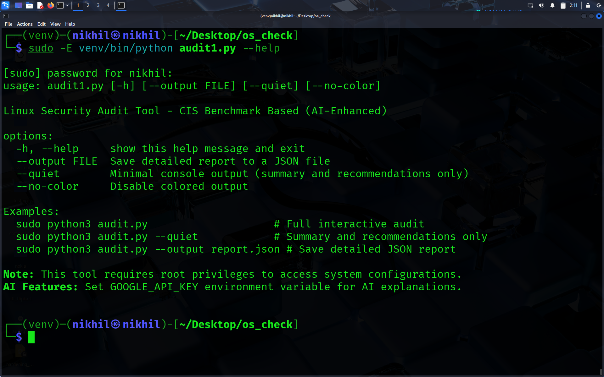

# 🛡️ Linux Security Audit Tool (CIS-Based)

A Python-based, command-line tool for auditing the security configuration of Debian 12 systems. This script automates checks based on the CIS (Center for Internet Security) Debian Linux 12 Benchmark to provide a security score, detailed results, and actionable recommendations for hardening your system.

```
CIS Benchmarks—detailed configuration guides for securing operating systems, cloud services, and software—and the CIS Controls,
a prioritized set of actions to protect against common cyberattacks. All of their guidance is developed through a global consensus
process involving subject matter experts, making it a trusted standard for system hardening. 
```
## ✨ Key Features

- `CIS Benchmark Alignment` : *Checks are based on high-impact recommendations from the official CIS Debian 12 Benchmark.*
- `AI-Powered Explanations` : *Uses Google's Gemini API to provide expert explanations for failed checks, explaining the `"why"` behind each recommendation.*
- `User-Friendly Output` : *Color-coded, icon-based reports make it easy to see the security posture of your system at a glance.*
- `Scoring System` : *Quantifies your system's security with a score and a letter grade, helping you track hardening progress.*
- `Actionable Recommendations` : *For every failed check, the tool provides the exact command or steps needed to fix the issue.*
- `JSON Reporting` : *Option to export the full audit results to a JSON file for automation, record-keeping, or integration with other tools.*

## 🚀 Getting Started

Follow these instructions to get the audit tool running on your system.

Prerequisites
```
- A Debian-based Linux system (tested on Debian 12).
- Python 3.6 or higher.
- Root (sudo) privileges to run the script.
- An active internet connection (for the AI features).
```

## Installation & Usage

- `Download the Script` : *Save the code provided as `audit.py` on your Linux system.*

#### Make it Executable :
```
chmod +X audit.py
```

*Step 1: Set Up the Environment*
---
Because modern Linux distributions protect system Python packages, you must create a virtual environment.

```
# 1. Create a virtual environment
python3 -m venv venv

# 2. Activate the environment
source venv/bin/activate
```

*Step 2: Install Dependencies*
---
With the environment active, install the required library for the AI features.

```
pip install google-generativeai
```

*Step 3: Set Your API Key*
---
Get a free API key from Google AI Studio. Then, set it as an environment variable in your terminal.
```
export GOOGLE_API_KEY="YOUR_API_KEY_HERE"
```

*Step 4: Run the Audit (AI-ENABLED)*
---
Run the script using `sudo -E`, which is crucial for passing your API key to the root environment where the script executes.
```
sudo -E python3 audit.py
```



### ⚙️ Command-Line Arguments

- *Help option*
```
sudo -E python3 audit.py --help
```


---

- Without AI scan
```
sudo python3 audit.py 
```


---

- Saving in json format
```
sudo python3 audit.py --output file_name.json
```


### 🤔 Troubleshooting

- `error` : externally-managed-environment: This means you're trying to pip install outside of a virtual environment.
Follow Step 1 to create and activate one.

- `AI disabled`: `GOOGLE_API_KEY not set`: This warning means you either forgot to run the export command or you didn't use `sudo -E` when running the script.
The -E flag is essential to preserve the API key variable for the sudo command.


### 📊 Sample Output (Screenshots)
